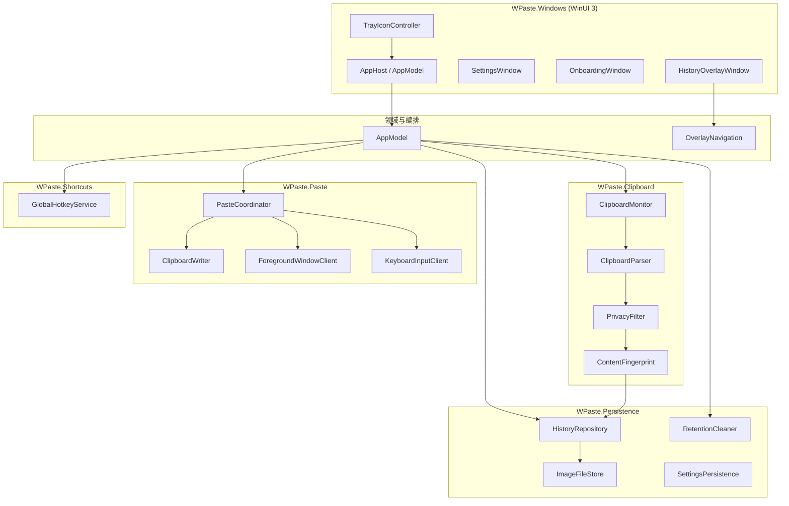

# WPaste Windows 版 v1.0 技术方案

> **文档状态**：方案审查 — READY WITH RISKS（`20260928_implementation-plan-review-02.md`）  
> **版本**：v0.2  
> **日期**：2026-09-28（v0.2 修订：2026-09-30）  
> **需求基线**：`20260928_prd-draft-02.md` v0.2（准入：READY WITH ASSUMPTIONS）  
> **准入假设**：`20260928_requirements-review-02.md` §7 AA1–AA5  
> **实现范围**：v1.0 MVP — SC1–SC11 / R1–R16 / AC1–AC16  
> **明确不做**：R17–R22（v1.1）、R23（v1.2+）

---

## 1. 方案摘要

| 项目 | 决策 |
|---|---|
| 对标 | macOS 0.1.1 模块语义（D1）；MVP 功能子集（D2） |
| 运行时 | **.NET 8**（LTS） |
| UI 壳 | **WinUI 3**（Windows App SDK 1.6+） |
| 托盘 | **H.NotifyIcon.WinUI**（首选）；WinForms `NotifyIcon` 仅作 Spike 失败回退 |
| 原生互操作 | **CsWin32** 生成 P/Invoke（剪贴板、窗口、SendInput、RegisterHotKey） |
| 持久化 | **SQLite**（`Microsoft.Data.Sqlite`）+ 本地图片目录 |
| 分发（AA1） | **MSIX 优先**；若打包链阻塞则 **Authenticode 签名 EXE** + Inno Setup |
| 最低系统 | **Windows 10 22H2（19045）+** / Windows 11 |
| 数据目录 | `%LocalAppData%\WPaste\`（A4） |
| Bundle ID 等价 | 安装身份 `com.chujianyun.wpaste`（与 macOS 一致，便于品牌统一） |

**架构原则**：与 macOS 相同——**深模块 + 薄 UI**；View/ViewModel 不直接访问剪贴板或数据库，经 Store/Coordinator 暴露状态（对标 macOS `AppModel` + SwiftUI）。

---

## 2. 约束与不可突破边界

来自 PRD 与准入审查，方案 **不得** 违反：

| 编号 | 约束 |
|---|---|
| C-PRD | 无账号、云同步、AI、遥测（NG1–NG3） |
| C-SCOPE | v1.0 不实现 Pinboard、链接预览、忽略应用列表、屏幕共享隐藏、快捷键自定义、数字快速粘贴 |
| C-PASTE | 自动粘贴 Must（D3）；失败必须降级为「已写入剪贴板 + 非阻塞提示 + 会话内权限引导 ≤1 次」（E1） |
| C-PRIVACY | 持久化前 PrivacyFilter（BR2）；MVP 含敏感/瞬时过滤且默认开启（D4） |
| C-FILE | 文件记录不复制源文件，仅路径（C2） |
| C-UPGRADE | 升级默认保留历史与设置（A5）；具体机制依赖 Q3 包型 |

---

## 3. 仓库与目录结构

在 monorepo 根目录新增 Windows 子树，与 macOS `WPaste/` 并列：

```text
wpaste/
├── WPaste/                          # 现有 macOS
├── WPaste.Windows/
│   ├── WPaste.Windows.sln
│   ├── src/
│   │   ├── WPaste.Windows/          # WinUI 3 可执行项目（入口、托盘、设置、引导）
│   │   │   └── Tray/                # TrayIconController（H.NotifyIcon.WinUI 封装）
│   │   ├── WPaste.Core/             # 领域模型、指纹、设置 DTO（无 UI 依赖）
│   │   ├── WPaste.Clipboard/        # 监听、解析、PrivacyFilter
│   │   ├── WPaste.Persistence/      # SQLite、图片文件、RetentionCleaner
│   │   ├── WPaste.Paste/            # PasteCoordinator、剪贴板写回
│   │   ├── WPaste.Shortcuts/        # RegisterHotKey 封装（v1.0 仅默认键）
│   │   └── WPaste.Platform/         # CsWin32 包装、ForegroundWindow、DPI/Monitor
│   ├── tests/
│   │   ├── WPaste.Core.Tests/
│   │   ├── WPaste.Clipboard.Tests/
│   │   ├── WPaste.Persistence.Tests/
│   │   └── WPaste.Paste.Tests/
│   └── packaging/
│       ├── msix/                    # Package.appxmanifest、Assets
│       └── scripts/
│           ├── build.ps1
│           ├── test.ps1
│           └── package-msix.ps1       # 对齐 windows-delivery-gate
├── .spec-to-ship/windows-port/      # 需求/方案/Spike 报告
└── Scripts/                         # 现有 macOS 脚本不动
```

**v1.1 预留**：`WPaste.Pinboards/`、`WPaste.Preview/` 目录占位 README，**v1.0 不引用**。

---

## 4. 系统架构

### 4.1 组件图



### 4.2 运行时线程模型

| 组件 | 线程 | 说明 |
|---|---|---|
| UI（WinUI） | STA 主线程 | 所有窗口、绑定、用户通知 |
| ClipboardMonitor | 主线程 + 剪贴板消息 | `WM_CLIPBOARDUPDATE` 通过 `HwndSource` 或隐藏 message window 投递到 UI 线程 |
| RetentionCleaner | `Task` 后台 | 启动后 + 定时；结果回主线程写库 |
| 图片缩略图生成 | 后台 | 写入 `ImageFileStore` 后刷新 UI |

**禁止**：后台线程直接更新 WinUI 绑定或调用 `OpenClipboard`。

### 4.3 macOS 模块映射

| macOS 模块 | Windows 模块 | v1.0 |
|---|---|---|
| `ClipboardMonitor` | `ClipboardMonitor` | ✅ |
| `ClipboardParser` | `ClipboardParser` | ✅ |
| `PrivacyFilter` | `PrivacyFilter` | ✅ MVP 子集（无忽略应用） |
| `HistoryStore` / `HistoryRepository` | `HistoryRepository` + SQLite | ✅ |
| `ImageFileStore` | `ImageFileStore` | ✅ |
| `PasteCoordinator` | `PasteCoordinator` | ✅ |
| `ShortcutManager` | `GlobalHotkeyService` | ✅ 仅默认键 |
| `OverlayWindowController` | `HistoryOverlayWindow` | ✅ |
| `PinboardStore` | — | ❌ v1.1 |
| `LinkPreviewService` | — | ❌ v1.1 |
| `LoginItemClient` | `StartupTaskService` | ✅ MSIX StartupTask 或 Registry Run |

---

## 5. 模块设计

### 5.1 ClipboardMonitor（R1、R2、BR1）

**职责**：监听系统剪贴板变化，解析 → 过滤 → 指纹 → 入库/更新。

**检测机制**（Spike 二选一，优先 A）：

| 方案 | API | 优点 | 风险 |
|---|---|---|---|
| **A（推荐）** | `AddClipboardFormatListener` + 隐藏 `HWND` 收 `WM_CLIPBOARDUPDATE` | 事件驱动、低 CPU | 需 message loop 窗口 |
| B | 轮询 `GetClipboardSequenceNumber()` | 实现简单 | 空转、延迟 |

**自写回抑制（BR1）**：与 macOS 相同，粘贴/写剪贴板后设置 `(fingerprint, suppressUntil)`，2 秒内同指纹跳过采集。

**来源应用（BR6）**：复制发生时调用 `GetForegroundWindow` → `GetWindowThreadProcessId` → 进程路径与友好名（`Process.GetProcessById` + `MainModule.FileName`）；持久化 `SourceProcessName`（显示名）与 `SourceExePath`（可选，仅展示不用于 v1.0 过滤）。

### 5.2 ClipboardParser（R1、AC1）

解析优先级与 macOS **一致**：

```text
1. CF_HDROP / FileDrop → 文件列表（多文件一条记录）
2. CF_DIB / CF_BITMAP / PNG（Registered Format）→ 图片
3. CF_UNICODETEXT / CF_TEXT → 若符合 http(s) URL 规则则 URL，否则文本
4. 其他 → 忽略（v1.0 不采集富文本 RTF/HTML 为独立类型；纯文本路径见 R8）
```

**URL 规范化**：与 macOS `ClipboardParser.normalizedURL` 相同——仅 `http`/`https`，host 必填，scheme/host 小写。

**图片**：读取位图数据 → 后台写入 `Images/{uuid}.png` + 缩略图 `{uuid}_thumb.png`（最长边 512）→ 数据库存相对路径与尺寸。

**文件**：仅存 `path` + `displayName`；**不**复制文件（R9）。v1.0 **不使用** macOS security-scoped bookmark；粘贴前 `File.Exists` 校验。

### 5.3 PrivacyFilter（R16、BR2、BR7、AC16）

MVP 规则（对标 `PrivacyFilter.swift`，**不含** `ignoredApplication`）：

| 规则 | macOS | Windows v1.0 映射 | 默认 |
|---|---|---|---|
| 暂停记录 | `recordingPaused` | `AppSettings.RecordingPaused` | — |
| 密码管理器来源 | Bundle ID 前缀表 | **进程 exe 名/路径前缀表**（见下表） | 拒绝 |
| 敏感内容 | `org.nspasteboard.ConcealedType` 等 | 见 **§5.3.1** | 拒绝（开关开） |
| 瞬时内容 | `TransientType`、remote clipboard | 见 **§5.3.1** | 拒绝（开关开） |

**密码管理器 exe 前缀表（初版，Spike 可增补）**：

```text
1Password.exe, 1password.exe
Bitwarden.exe
LastPass.exe
Dashlane.exe
KeePass.exe, KeePassXC.exe
```

**§5.3.1 Windows 敏感/瞬时检测（AA4 — Spike 必验）**

> **澄清（回应 F3）**：`ExcludeClipboardContentFromMonitorProcessing` 是**写入方**调用的 API，同时也会在剪贴板上放置**同名已注册格式**（presence-only）。读取方 WPaste **不得**调用该 API 来判断他人复制的内容；应在 `OpenClipboard` 后 **枚举格式 ID** 检测 opt-out 标记。

**实现组件**：`WPaste.Clipboard/ClipboardOptOutProbe.cs`

| 优先级 | 格式名（`RegisterClipboardFormatW`） | 读取规则 | 映射 macOS |
|---|---|---|---|
| 1 | `ExcludeClipboardContentFromMonitorProcessing` | **格式 ID 存在即拒绝**（不读 payload） | 敏感/监控排除 |
| 2 | `Clipboard Viewer Ignore` | **格式 ID 存在即拒绝** | 遗留敏感标记 |
| 3 | `CanIncludeInClipboardHistory` | 格式存在且 payload `DWORD == 0` → 拒绝 | 瞬时/不应入历史 |
| 4 | `CanUploadToCloudClipboard` | 格式存在且 payload `DWORD == 0` → 拒绝 | 云剪贴板排除（作瞬时同类处理） |

**枚举算法**（`WM_CLIPBOARDUPDATE` 后、`Parse` 前）：

```text
OpenClipboard(hwnd)
  → ids = EnumClipboardFormats 全量
  → 对 1–2：RegisterClipboardFormatW(name) ∈ ids ? reject(sensitive)
  → 对 3–4：若 id ∈ ids，GlobalSize/GetClipboardData 读 DWORD，== 0 ? reject(transient)
CloseClipboard
```

**密码管理器来源**（独立规则）：复制时前台进程 exe 名匹配 §5.3 表 → `reject(passwordManager)`。

**Spike 产出物**：`20260928_spike-privacy-{NN}.md`，矩阵至少包含：

| 样本操作 | 预期 |
|---|---|
| Edge/Chrome 密码框复制 | 不入库 |
| 记事本普通文本 | 入库 |
| 1Password/Bitwarden 复制 | 不入库 |
| 关闭「忽略敏感内容」后上述敏感样本 | 行为对标 macOS PrivacyFilterTests（若 macOS 允许则入库） |

若四格式检测仍无法覆盖 macOS 同等场景 → 触发 AA4 失效流程，回写 PRD。

**设置默认值**（对标 S4 `AppSettings.swift`）：

```csharp
IgnoreSensitiveContent = true,
IgnoreTransientContent = true,
RecordingPaused = false,
Retention = SevenDays,
DefaultPasteBehavior = Automatic,
DefaultPlainText = false,
HideDuringScreenSharing = true,  // v1.0 设置 UI 隐藏（F8）；v1.1 启用行为
LinkPreviewsEnabled = true,      // v1.0 设置 UI 隐藏（F8）；v1.1 启用预览
```

### 5.4 ContentFingerprint（R2、AC2）

与 macOS `ContentFingerprint.swift` **算法一致**（跨平台去重关键）：

- 文本：规范化 `\r\n` → `\n` 后 `SHA256("text\0{body}")`
- URL：`SHA256("url\0{absoluteString}")`
- 图片：`SHA256("image\0{width}x{height}\0{relativePath}")`（路径为相对路径）
- 文件：`SHA256("files\0{path1}\0{path2}...")`，路径顺序与 **CF_HDROP 枚举顺序一致**（**不排序**；对标 macOS `ContentFingerprint.swift:15` `files.map(\.path).joined`）

**跨平台去重**：Windows 与 macOS 对同一批文件的 fingerprint **可能不同**（路径分隔符/大小写）；各自平台内去重一致即可。单元测试须覆盖「同序多文件 → 同 fingerprint」。

**重复复制**：同 fingerprint 更新 `LastUsedAt` 并置顶，不 INSERT 新行。

### 5.5 HistoryRepository + ImageFileStore（R9–R12、R10、AC9–AC12）

**数据库路径**：`%LocalAppData%\WPaste\wpaste.db`

**MVP 表结构**（Pinboard 表 v1.1 再迁移）：

```sql
CREATE TABLE clipboard_items (
    id TEXT PRIMARY KEY,
    fingerprint TEXT NOT NULL UNIQUE,
    kind TEXT NOT NULL,           -- text|url|image|files
    text_value TEXT,
    url_value TEXT,
    image_width INTEGER,
    image_height INTEGER,
    image_relative_path TEXT,
    files_json TEXT,              -- JSON array of {path, displayName}
    source_process_name TEXT NOT NULL,
    source_exe_path TEXT,
    created_at TEXT NOT NULL,
    last_used_at TEXT NOT NULL
);
CREATE INDEX idx_last_used ON clipboard_items(last_used_at DESC);
```

**设置**：JSON 文件 `%LocalAppData%\WPaste\settings.json`（与 DB 分离，便于迁移）。

**RetentionCleaner**：启动 + 每 6 小时；按 `Retention` 删除过期行及关联图片文件（对标 macOS）。

**损坏记录（BR5）**：读取失败标记 `corrupt`，启动不崩溃；设置页 v1.0 可提供「修复数据库」占位。

### 5.6 PasteCoordinator（R7、R8、D3、AC7、E1–E2）

**接口语义**对齐 macOS `PasteCoordinator.paste(item:mode:target:)`：

```csharp
enum PasteMode {
    Automatic(plainText: bool),
    CopyOnly(plainText: bool)
}

enum PasteFallbackReason {
    InputSimulationFailed,   // SendInput 失败或策略拦截
    TargetUnavailable,
    ActivationFailed
}

// PasteCoordinator 内部（回应 F6，对标 macOS hasRequestedAccessibilityPermission）
bool _hasShownPasteHintThisSession;

enum PasteResult {
    Pasted,
    CopiedOnly(PasteFallbackReason),
    Copied,
    Unavailable
}
```

**流程（D3）**：

```text
1. suppressWrite(fingerprint, now + 2s)
2. ClipboardWriter.Write(payload, plainText) → 失败则 Unavailable
3. CloseOverlay()
4. 若 CopyOnly → return Copied
5. 若 target 进程已退出 → CopiedOnly(TargetUnavailable)
6. ForegroundWindowClient.Activate(target) → 失败 CopiedOnly(ActivationFailed)
7. KeyboardInputClient.SendPasteChord() → 失败时：
     → 若 !_hasShownPasteHintThisSession：Toast + 帮助链接；_hasShownPasteHintThisSession = true
     → return CopiedOnly(InputSimulationFailed)   // 对标 E1 / D3
8. return Pasted
```

**Windows 粘贴实现（Spike DEP2 结论 — 推荐路径）**：

| 步骤 | 推荐 API | 备注 |
|---|---|---|
| 写剪贴板 | `OpenClipboard` / `SetClipboardData` / `EmptyClipboard` | 封装为 `ClipboardWriter`；STA 主线程 |
| 恢复前台 | `SetForegroundWindow` + `AttachThreadInput` 技巧 | 对标 macOS `activate` |
| 模拟按键 | **`SendInput`** 发送 `Ctrl+V` | 无需 UI Automation 权限；UAC  elevated 目标可能失败 → 降级 |
| 权限 | **无单独「辅助功能」开关**；若 SendInput 被策略拦截则 E1 降级 | 文案对标 macOS 首次引导，说明「部分安全软件可能阻止自动粘贴」 |

**纯文本（R8）**：`plainText=true` 时只写 `CF_UNICODETEXT` 字符串；MVP 通过设置默认 + 条目粘贴模式，右键单条纯文本 v1.1。

**打开面板前**：`showHistory()` 时 `ForegroundWindowClient.CaptureCurrent()` 保存 `HWND` + 进程 id。

### 5.7 GlobalHotkeyService（R3、AA2、H1/E7）

**默认**：`RegisterHotKey(hwnd, id, MOD_CONTROL | MOD_SHIFT, VK_V)` → Ctrl+Shift+V。

**v1.0 冲突策略（回应 H1，写入方案 E7）**：

| 顺序 | 组合 | 行为 |
|---|---|---|
| 1 | Ctrl+Shift+V | 首选 |
| 2 | Ctrl+Shift+Insert | 注册失败时自动尝试 |
| 3 | 均失败 | 托盘气泡提示「快捷键被占用，请从托盘打开历史」；设置页 v1.0 显示当前有效键（只读） |

**面板内键盘**：←/→ 选择、Enter 粘贴、Esc 关闭（R6）；焦点在搜索框时仍允许 ←/→ 切换条目（对标 macOS）。

**v1.1**：可配置快捷键迁回 `ShortcutManager` 完整实现。

### 5.8 HistoryOverlayWindow（R3–R6、R15、E3）

**窗口类型**：WinUI 3 无边框 `OverlappedPresenter` 或独立 `WindowEx`；`WS_EX_TOPMOST | WS_EX_TOOLWINDOW`（不抢任务栏）。

**布局**：

- 定位：当前焦点监视器 `MonitorFromWindow` → `GetMonitorInfo` → 工作区底部上方 16px（对标 macOS 安全区）
- 宽度：监视器工作区宽度 − 边距；高度固定 ~220px（DPI 缩放）
- 内容：横向 `ItemsRepeater` / 自定义 `ScrollViewer` 卡片带；顶部搜索框
- 失焦：点击外部或 Esc 关闭（macOS 行为）；**v1.0 不做**屏幕共享隐藏

**卡片右键（R15）**：「复制到剪贴板」「删除」；复制走 `CopyOnly` 模式且不关闭面板（与 macOS 右键「复制」一致，Spike 确认 UX）。

### 5.9 托盘与设置（R13、R12、R14）

**TrayIconController**（回应 **F1**）：

| 层级 | 选型 | 说明 |
|---|---|---|
| **首选** | NuGet **`H.NotifyIcon.WinUI`** | WinUI 3 官方社区方案；`TaskbarIcon` + XAML `MenuFlyout`；与 `AppModel` 同进程 STA |
| **回退** | 隐藏 **WinForms** `NotifyIcon` + 专用 STA 线程 | 仅当 MSIX 打包或 WinUI 托盘 Spike 失败时启用；菜单命令 Post 到 UI 线程 |

**集成要点**：

- 托盘图标在 `App.OnLaunched` 初始化，**不依赖** Overlay 窗口可见性
- 菜单项：打开历史、暂停/恢复记录、设置、退出（R13）
- 双击图标 → `AppModel.ShowHistory()`（R13）
- 图标资源：自 macOS 资产导出 `Assets/WPaste.ico`（多尺寸 16–256）
- 全局快捷键 `RegisterHotKey` 的 `HWND` 可与 `H.NotifyIcon` 内部 message window 共用，或单独 `NativeMessageWindow`（`WPaste.Platform`）

**SettingsWindow**（v1.0 页签）：

| 页签 | 项 | 需求 |
|---|---|---|
| 通用 | 登录时启动、默认粘贴行为、纯文本默认、保留期限、清空历史 | R7–R8、R11–R12 |
| 隐私 | 敏感/瞬时开关、退出时清空；**无**忽略应用列表 | R16 |
| 关于 | MVP 与 macOS 差异说明链接 | D2、A6 |

**v1.1 预留设置项（F8）**：`HideDuringScreenSharing`、`LinkPreviewsEnabled` **不在 v1.0 设置 UI 展示**（JSON 可保留默认值，避免 v1.1 迁移丢失）。

**OnboardingWindow（R14）**：首次运行 modal；确认本地保存、7 天保留、自动粘贴说明。

**开机自启（SC9）**：

- MSIX：`windows.startupTask`（AA1 首选）
- EXE 回退：`HKCU\Software\Microsoft\Windows\CurrentVersion\Run` 写入 `"WPaste"="...\WPaste.Windows.exe"`

---

## 6. 数据流

### 6.1 采集流

```text
WM_CLIPBOARDUPDATE
  → ClipboardMonitor.OnClipboardChanged
  → ClipboardOptOutProbe.HasOptOutFormats() ? PrivacyFilter reject
  → ClipboardParser.Parse
  → PrivacyFilter.Decide(settings) → Reject? skip
  → ContentFingerprint.Make
  → suppress check
  → HistoryRepository.Upsert (new or touch last_used_at)
  → ImageFileStore.SaveAsync (if image)
  → UI refresh debounced
```

### 6.2 粘贴流

```text
User Enter/Click
  → AppModel.PasteSelected(mode from settings)
  → PasteCoordinator.Paste(item, mode, capturedTarget)
  → [write clipboard → hide overlay → activate → SendInput]
  → Toast on CopiedOnly (respect session-once for permission hint)
```

---

## 7. 与 PRD 追踪矩阵

| PRD | 模块 | 验收 |
|---|---|---|
| R1 SC1 | ClipboardMonitor + Parser | AC1 |
| R2 SC2 | ContentFingerprint + Repository | AC2 |
| R3 SC3 | GlobalHotkeyService | AC3 |
| R4 SC4 | HistoryOverlayWindow | AC4 |
| R5 SC4 | Overlay 搜索过滤 | AC5 |
| R6 SC4 | OverlayNavigation | AC6 |
| R7 SC5 | PasteCoordinator | AC7 |
| R8 SC6 | ClipboardWriter + settings | AC8 |
| R9 SC1 | Parser files + Repository | AC9 |
| R10 SC1 | ImageFileStore | AC10 |
| R11 SC7 | RetentionCleaner | AC11 |
| R12 SC8 | AppModel + Settings | AC12 |
| R13 SC9 | TrayIconController | AC13 |
| R14 SC10 | OnboardingWindow | AC14 |
| R15 §5.3 | Context menu | AC15 |
| R16 SC11 | PrivacyFilter | AC16 |

---

## 8. Spike 计划（首 Sprint）

| ID | 名称 | 目标 | 通过标准 | 报告路径 |
|---|---|---|---|---|
| **SP1** | DEP2 自动粘贴 | SendInput + 前台恢复 | 记事本、Word、Edge 输入框 AC7 主路径；失败 E1 降级 | `20260928_spike-paste-{NN}.md` |
| **SP2** | DEP1 剪贴板 | 四类解析 + 去重 | AC1、AC2 样本通过 | `20260928_spike-clipboard-{NN}.md` |
| **SP3** | AA4 隐私过滤 | Windows 敏感/瞬时映射 | AC16 矩阵与 macOS 行为一致 | `20260928_spike-privacy-{NN}.md` |
| **SP4** | Q3 安装 | MSIX 打包 + 数据目录 | 安装、启动、卸载保留/清除策略文档化 | `20260928_spike-packaging-{NN}.md` |
| **SP5** | H1 热键冲突 | 次选键 + 托盘降级 | E7 行为可演示 | 合并入 SP1 或独立 |

**Gate**：SP1–SP3 通过后再合并主分支实现；SP4 可与 MVP 功能并行。

---

## 9. 测试策略

对标 macOS 测试分层（`WPasteTests/`）：

| 层 | 项目 | 覆盖 |
|---|---|---|
| 单元 | `WPaste.Core.Tests` | Fingerprint、URL 规范化、Retention 计算 |
| 单元 | `WPaste.Clipboard.Tests` | Parser 四类、PrivacyFilter、**ClipboardOptOutProbe** |
| 单元 | `WPaste.Persistence.Tests` | Upsert 去重、过期清理、损坏隔离 |
| 单元 | `WPaste.Paste.Tests` | PasteCoordinator 状态机（mock Writer/Input/Foreground） |
| 集成 | `WPaste.Clipboard.Tests`（Integration） | 真实剪贴板 round-trip（需 STA，CI 用 Windows runner） |
| 手工 | AA3 矩阵 | Edge、Chrome、资源管理器、Office/WPS、微信、VS Code |

**CI**：GitHub Actions `windows-latest` 运行 `dotnet test`；发布流水线 Windows only。

**交付门禁**：实现阶段遵循 `windows-delivery-gate` Skill（测试报告 → MSIX/EXE → 安装验证）。

---

## 10. 构建与发布

| 项 | 方案 |
|---|---|
| 构建 | `dotnet publish -c Release -r win-x64 --self-contained false` |
| 签名 | Authenticode（EV 或标准代码签名证书）；MSIX 双重签名 manifest + payload |
| 版本 | 与 macOS 语义对齐：`1.0.0` 首版；`AssemblyVersion` / MSIX `Identity Version` 同步 |
| 升级 | MSIX 同 Publisher/Name 递增版本（A5）；EXE 安装器需写升级检测（SP4 定） |
| 产物 | `build/WPaste-1.0.0-x64.msix` 或 `build/WPaste-Setup-1.0.0.exe` |

---

## 11. v1.1 扩展点（本方案仅预留）

| 能力 | 扩展方式 |
|---|---|
| Pinboard | 新增表 `pinboards`、`pinboard_items`；UI 导航栏 |
| 链接预览 | `LinkPreviewService` + HTTP 缓存目录 |
| 忽略应用 | `AppSettings.IgnoredExeNames` + PrivacyFilter 分支 |
| 屏幕共享隐藏 | `WDA_EXCLUDEFROMCAPTURE` 或 Win11 屏幕捕获 API |
| 快捷键 | 完整 `ShortcutManager` + 低层钩子或 RegisterHotKey 多组 |
| 数字粘贴 | 面板内 RegisterHotKey Ctrl+1…9（仅面板可见时） |

---

## 12. 待决事项（方案层）

| ID | 问题 | 负责人 | 阻塞 |
|---|---|---|---|
| TD1 | MSIX  vs EXE 最终选择（Q3） | U2 + 构建 | 发布流水线 |
| TD2 | SendInput 在企业 ED R 环境失败率 | Spike SP1 | 仅影响 E1 文案 |
| TD3 | AC16 Windows 样本集最终表 | Spike SP3 | 隐私模块合并 |
| TD4 | 默认快捷键次选键是否采用 Ctrl+Shift+Insert | U2 | 低；可随 SP5 默认 |

---

## 13. 修订与下一步

### v0.2 相对 v0.1（响应 `implementation-plan-review-01`）

| 审查项 | 修订 |
|---|---|
| **F1** | §5.9 明确 **H.NotifyIcon.WinUI** 首选 + WinForms 回退 |
| **F3** | §5.3.1 重写为 `ClipboardOptOutProbe` 四格式枚举；区分写入 API vs 读取检测 |
| **F5** | §5.4 文件 fingerprint 改为 CF_HDROP **顺序**（不排序） |
| **F6** | §5.6 增加 `_hasShownPasteHintThisSession` |
| **F8** | §5.3/§5.9 v1.1 设置项 v1.0 UI 隐藏 |

### 下一步

| 步骤 | 动作 |
|---|---|
| 1 | ~~implementation-plan-review~~ ✅ |
| 2 | ~~修订 F1/F3/F5~~ ✅ v0.2 |
| 3 | ~~方案 v0.2 复审~~ ✅ `20260928_implementation-plan-review-02.md` |
| 4 | 执行 **SP1–SP3** Spike 并落盘报告 |
| 5 | 并行初始化 `WPaste.Windows/` 骨架 + Spike 工程 |
| 6 | Gate 通过后全量实现 R1–R16（AC1–AC16） |

**相对 macOS 刻意保持差异（已文档化）**：菜单栏 → 托盘；Bundle ID → exe 名；bookmark → 路径字符串；Accessibility → SendInput；Pinboard/预览 v1.1。
