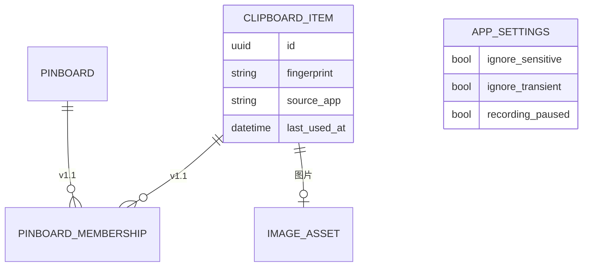

# WPaste Windows 版 PRD 初稿

> **文档状态**：需求准入 — READY WITH ASSUMPTIONS（见 `20260928_requirements-review-02.md`）  
> **草稿状态**：可进入方案设计（v1.0 MVP：SC1–SC11 / R1–R16 / AC1–AC16）  
> **版本**：v0.2（当前有效版本）  
> **起草日期**：2026-09-28  
> **修订依据**：需求审查建议与用户确认（2026-09-28）；准入复审 20260928_requirements-review-02  
> **证据范围**：S1–S8；未纳入 Windows 技术方案与市场调研

## 1. 一页摘要

| 项目 | 内容 | 状态与依据 |
|---|---|---|
| 目标用户 | 在 Windows 上频繁复制粘贴文字、链接、图片和文件的桌面用户 | 已确认；S1、S2 |
| 核心问题 | 系统剪贴板只保留最后一次复制，用户无法搜索、收藏或快速复用历史内容 | 已确认；S1、S2 |
| 期望结果 | 提供与 **macOS 版 WPaste 核心工作流一致**的本地剪贴板历史工具；平台 UI（托盘 vs 菜单栏）允许差异 | 已确认；D1、D2；S3 |
| 首版范围 | **MVP（v1.0 Windows）**：SC1–SC11 + R1–R16；**v1.1** 补齐 Pinboard、链接预览、忽略应用、完整快捷键等 | 已确认；D2、D4；S8 |
| 最高风险缺口 | 安装包形态（Q3）、Windows 自动粘贴实现机制（方案 Spike）、忽略应用标识方式（Q7） | Q3、Q7；D3 已闭合产品行为 |

## 2. 背景与问题

### 2.1 当前情况

WPaste 是 **macOS 15+ 原生剪贴板历史工具**（仓库无 iOS 目标），当前发布 **0.1.1**，常驻菜单栏，全局快捷键打开横向历史面板（S1、S2、S3）。

**对标基准（D1）**：Windows 版以 **macOS 0.1.1 用户可见能力** 为功能对标；macOS 工作区增量 **视频首帧预览（S6）** 归入 Windows v1.2+，非 MVP。

产品定位：本地存储、无账号、无云同步、无 AI/订阅/遥测（S3）。

### 2.2 核心问题

Windows 桌面用户同样面临「复制后找不到上一条内容」的问题；仅提供 macOS 版时，Windows 用户与跨平台用户无法获得一致的核心工作流。

### 2.3 与 macOS 的功能分层

| 版本 | Windows 交付 | macOS 对标 |
|---|---|---|
| **v1.0 MVP** | SC1–SC11：核心闭环 + 敏感/瞬时过滤 | 0.1.1 核心能力子集（**不含** Pinboard、链接预览、忽略应用列表、屏幕共享隐藏、快捷键自定义、数字快速粘贴） |
| **v1.1** | SC12–SC17 | 0.1.1 剩余用户可见能力 |
| **v1.2+** | SC18–SC19 | S6 视频首帧等增量 |

MVP 与 macOS 差异须在 README/首次运行说明中**明示**（D2、A6）。

## 3. 用户与相关角色

| 角色编号 | 角色 | 使用或决策关系 | 目标 | 状态与依据 |
|---|---|---|---|---|
| U1 | Windows 桌面用户 | 使用者 | 快速找回并粘贴近期复制内容 | 已确认；S1 |
| U2 | 产品负责人 | 决策者 | 范围与验收 | D1–D4 已记录 |
| U3 | 需求审查者 | 验收者 | 准入审查 | S8 |

## 4. 产品目标、成功标准与非目标

### 4.1 产品目标

| 目标编号 | 目标 | 成功的可观察表现 | 状态与依据 |
|---|---|---|---|
| G1 | 可持续记录并浏览剪贴板历史 | 四类内容入历史；去重置顶 | 已确认；S1、S3 |
| G2 | 快捷键呼出历史并完成粘贴 | 全局快捷键 + 键盘/鼠标选中粘贴 | 已确认；D3、Q4 草案 |
| G3 | 本机存储、用户可控保留 | 保留期限、暂停、清空；无云同步 | 已确认；D2 接受 A2 |
| G4 | 权限缺失或内容失效时安全降级 | 见 R7、E1–E2 | 已确认；D3、S2 |

### 4.2 非目标

| 编号 | 非目标 | 纳入版本 | 依据 |
|---|---|---|---|
| NG1 | 账号、云同步 | 不在路线图 | S3；A2 已接受 |
| NG2 | AI/OCR/智能分类 | — | S3 |
| NG3 | 订阅、遥测 | — | S3 |
| NG4 | 富文本样式完整保留 | — | S3 |
| NG5 | 视频首帧预览 | v1.2+（SC18） | S6；Q5 |
| NG6 | 跨 macOS↔Windows 同步 | — | A2 已接受 |
| NG7 | 屏幕共享期间隐藏面板 | v1.1（SC15）；MVP 不做 | D2、H5 |

## 5. 范围与优先级

### 5.1 定义

- **完整对等**：macOS 0.1.1 + S6 的用户可观察行为（Windows 平台映射后）。
- **MVP（v1.0）**：「记录 → 搜索 → 选中 → 粘贴/复制」闭环 + macOS 默认级敏感/瞬时过滤（D4）。

### 5.2 范围表

| 范围编号 | 能力或结果 | 优先级 | 版本 | 状态与依据 |
|---|---|---|---|---|
| SC1 | 监听剪贴板：文本、URL、图片、单/多文件 | Must | v1.0 MVP | 已确认；S1、S3 |
| SC2 | 去重合并，再次复制置顶 | Must | v1.0 MVP | 已确认；S3 |
| SC3 | 全局快捷键呼出/收起面板 | Must | v1.0 MVP | 已确认；Q4 草案 |
| SC4 | 面板：搜索、横向卡片、←/→ 键盘导航 | Must | v1.0 MVP | 已确认；S1 |
| SC5 | 自动粘贴或仅复制（可配置） | Must | v1.0 MVP | 已确认；D3 |
| SC6 | 纯文本粘贴（设置默认；单条触发 MVP 经右键或设置） | Must | v1.0 MVP | 已确认；S1 |
| SC7 | 保留期限（默认 1 周）与过期清理 | Must | v1.0 MVP | 已确认；S4 |
| SC8 | 暂停记录、退出可选清空、手动清空全部 | Must | v1.0 MVP | 已确认；S1 |
| SC9 | 系统托盘常驻、设置、开机自启 | Must | v1.0 MVP | 已确认；S1 |
| SC10 | 首次运行隐私说明 | Must | v1.0 MVP | 已确认；S3 |
| SC11 | **敏感/瞬时剪贴板过滤**（默认开启，设置可关） | Must | v1.0 MVP | 已确认；D4、S4 |
| SC12 | Pinboard 全套 | Should | v1.1 | 已确认；S1；D2 |
| SC13 | 链接预览（可关闭） | Should | v1.1 | 已确认；S1 |
| SC14 | 忽略指定来源应用 | Should | v1.1 | 已确认；S1、Q7 |
| SC15 | 屏幕共享期间隐藏面板 | Should | v1.1 | 已确认；NG7 |
| SC16 | 可配置快捷键 + 冲突检测 | Should | v1.1 | 已确认；S3 |
| SC17 | 数字快速粘贴 Ctrl+1…9；Pinboard 视图切换快捷键 | Should | v1.1 | 已确认；S3 |
| SC18 | 视频首帧卡片预览 | Could | v1.2+ | 草案建议；S6 |
| SC19 | 清理链接预览缓存 | Could | v1.1+ | 已确认；S1 |
| SC20 | 音效开关 | Could | 后续 | 已确认；S3 |

### 5.3 MVP 右键菜单（D2 / H2）

MVP 卡片右键 **Must** 仅包含：

- **复制到剪贴板**（不关闭面板或按 macOS 行为关闭，方案阶段定细节）
- **删除此条历史**

纯文本粘贴、收藏到 Pinboard → **v1.1**（SC12 上下文）。

### 5.4 MVP 与 macOS 0.1.1 差异摘要

| 维度 | v1.0 MVP | macOS 0.1.1 | v1.1 补齐 |
|---|---|---|---|
| 核心闭环 | ✅ | ✅ | — |
| 敏感/瞬时过滤 | ✅ 默认开 | ✅ 默认开 | — |
| 忽略应用 | ❌ | ✅ | SC14 |
| Pinboard | ❌ | ✅ | SC12 |
| 链接预览 | ❌ | ✅ | SC13 |
| 屏幕共享隐藏 | ❌ | ✅ 默认开 | SC15 |
| 快捷键自定义 | ❌ 仅默认 | ✅ | SC16 |
| 数字快速粘贴 | ❌ | ✅ | SC17 |
| 完整右键菜单 | 复制+删除 | 全套 | v1.1 |

## 6. 核心用户场景

### US1：快捷键找回并粘贴（v1.0 MVP）

- **主流程**：Ctrl+Shift+V（草案）→ 选中 → Enter/点击 → 自动粘贴或复制
- **关键例外（D3）**：
  - 自动粘贴不可用 → 内容已在系统剪贴板；**同一会话仅提示一次**权限引导；用户仍可手动 Ctrl+V
  - 目标应用已退出 → 仅复制
  - 源文件失效 → 可见不可粘贴
- **依据**：S2、D3

### US2：搜索历史（v1.0 MVP）

- 同 v0.1；已确认

### US3：Pinboard 收藏（v1.1）

- 纳入 SC12；MVP 不验收

### US4：暂停记录（v1.0 MVP）

- 同 v0.1；已确认

### US5：敏感内容不被记录（v1.0 MVP，新增）

- **触发**：从密码管理器复制，或剪贴板带敏感/瞬时语义
- **结果**：历史不增加（过滤默认开启，对标 S4）
- **依据**：D4、S3、S4

## 7. 功能需求

| 需求编号 | 需求描述 | 优先级 | 版本 | 验收 | 状态与依据 |
|---|---|---|---|---|---|
| R1 | 监听并解析文本/URL/图片/文件 | Must | v1.0 | AC1 | 已确认；S1 |
| R2 | 去重，再次复制置顶 | Must | v1.0 | AC2 | 已确认；S3 |
| R3 | 全局快捷键打开/关闭面板（默认 Ctrl+Shift+V，Q4 草案） | Must | v1.0 | AC3 | 草案建议；Q4 |
| R4 | 卡片展示来源、时间、摘要/缩略图、选中态 | Must | v1.0 | AC4 | 已确认；S1 |
| R5 | 搜索文本/URL/文件名/来源应用 | Must | v1.0 | AC5 | 已确认；S1 |
| R6 | **←/→** 选择记录，Enter 粘贴，Esc 关闭 | Must | v1.0 | AC6 | 已确认；S1 |
| R7 | **D3** 默认自动粘贴到开面板前的前台应用；可改仅复制；失败降级见 E1 | Must | v1.0 | AC7 | 已确认；D3、S2 |
| R8 | 纯文本粘贴：可设默认；MVP 经设置或 v1.1 右键 | Must | v1.0 | AC8 | 已确认；SC20 拆分 |
| R9 | 文件仅存路径；失效标记 | Must | v1.0 | AC9 | 已确认；S1 |
| R10 | 图片本地存储 + 相对路径 | Must | v1.0 | AC10 | 已确认；S3 |
| R11 | 保留期限，默认 7 天 | Must | v1.0 | AC11 | 已确认；S4 |
| R12 | 暂停、手动清空、可选退出清空 | Must | v1.0 | AC12 | 已确认；S1 |
| R13 | 系统托盘 + 设置/暂停/退出 | Must | v1.0 | AC13 | 已确认；S1 |
| R14 | 首次运行：本地保存、默认 7 天、**自动粘贴意图与权限说明（D3）** | Must | v1.0 | AC14 | 已确认；D3 |
| R15 | 卡片右键：**复制到剪贴板、删除此条** | Must | v1.0 | AC15 | 已确认；D2、H2 |
| R16 | 敏感/瞬时剪贴板过滤，**默认开启**，设置可关 | Must | v1.0 | AC16 | 已确认；D4、S4 |
| R17 | Pinboard CRUD + 多对多收藏 | Should | v1.1 | AC17 | 已确认；D2 |
| R18 | URL 链接预览，可关闭 | Should | v1.1 | AC18 | 已确认；D2 |
| R19 | 忽略指定来源应用 | Should | v1.1 | AC19 | 待确认；Q7 |
| R20 | 屏幕共享期间隐藏面板 | Should | v1.1 | AC20 | 已确认；NG7 |
| R21 | 自定义快捷键 + 冲突处理 | Should | v1.1 | AC21 | 已确认；S3 |
| R22 | Ctrl+1…9 快速粘贴；Pinboard 视图切换快捷键 | Should | v1.1 | AC22 | 已确认；S3 |
| R23 | 视频首帧预览 | Could | v1.2+ | AC23 | 草案建议；S6 |

### R7 / D3 自动粘贴产品定义（Must 行为，机制留方案）

1. 打开面板前记录前台应用窗口。
2. 用户确认条目后：写剪贴板 → 关闭面板 → 恢复前台焦点 → **尝试**发送粘贴按键。
3. 任一步失败或权限不足：**内容已在剪贴板**；显示非阻塞提示；**每启动会话最多一次**权限引导（对标 S2）。
4. 设置「仅复制到剪贴板」时跳过步骤 3 的按键模拟。
5. 具体 API（SendInput / UI Automation 等）**不属于本 PRD**，由方案 Spike 决定（原 Q2 技术部分）。

## 8. 业务规则、权限与状态

### 8.1 业务规则

| 规则编号 | 规则 | 版本 | 状态与依据 |
|---|---|---|---|
| BR1 | 自粘贴/写剪贴板时短期抑制监听 | v1.0 | 已确认；S3 |
| BR2 | 持久化前执行 PrivacyFilter；拒绝内容不入库 | v1.0 | 已确认；D4 |
| BR3 | 删历史同步删图片；Pinboard 关系级联 | v1.0+ | 已确认；S3 |
| BR4 | 链接预览失败仍存 URL | v1.1 | 已确认；S3 |
| BR5 | 坏记录不阻塞启动 | v1.0 | 已确认；S3 |
| BR6 | Windows 来源应用：进程可执行文件名（+ 可选完整路径展示）；忽略列表 v1.1 按 Q7 | v1.0 展示 / v1.1 忽略 | 草案建议；Q7 |
| BR7 | MVP 过滤至少覆盖：已知密码管理器来源、敏感/瞬时剪贴板格式（Windows 映射由方案定义，**产品结果**对标 macOS PrivacyFilter） | v1.0 | 已确认；D4、S3 |

### 8.2 角色与权限

| 角色 | 可执行动作 | 不可执行动作 | 状态 |
|---|---|---|---|
| U1 | 本机历史/设置 | 其他用户数据（A4） | A4 已接受 |
| U1 自动粘贴 | D3 成功路径粘贴 | 未授权时静默绕过系统限制 | D3 已确认 |

### 8.3 生命周期

同 v0.1；E5 关联 **R16**（v1.0 MVP）。

### 8.4 ER 图

Pinboard 实体 **v1.1** 启用；MVP ER 以 CLIPBOARD_ITEM + APP_SETTINGS 为主。

## 9. 边界与异常

| 编号 | 场景 | 预期结果 | 需求 | 版本 |
|---|---|---|---|---|
| E1 | 自动粘贴不可用（D3） | 剪贴板已更新；会话内权限提示 ≤1 次 | R7 | v1.0 |
| E2 | 目标应用已退出 | 仅复制 | R7 | v1.0 |
| E3 | 多显示器 / 高 DPI | 面板在当前焦点显示器工作区底部 | R3、R4 | v1.0 |
| E4 | 全局快捷键冲突 | v1.0 使用默认键；v1.1 自定义失败则保留旧值 | R21 | v1.1 |
| E5 | 敏感/瞬时/密码管理器内容 | 默认不记录 | R16 | v1.0 |
| E6 | 升级安装 | 默认保留历史与设置（A5） | R11 | v1.0+ |

## 10. 验收标准

| 编号 | 需求 | 可观察结果 | 版本 | 状态 |
|---|---|---|---|---|
| AC1 | R1 | 四类内容入历史 | v1.0 | 已确认 |
| AC2 | R2 | 重复复制仅一条且置顶 | v1.0 | 已确认 |
| AC3 | R3 | 快捷键开/关面板 | v1.0 | 草案；Q4 |
| AC4 | R4 | 卡片信息完整 | v1.0 | 已确认 |
| AC5 | R5 | 搜索过滤正确 | v1.0 | 已确认 |
| AC6 | R6 | ←/→、Enter、Esc 符合预期 | v1.0 | 已确认 |
| AC7 | R7 | 自动粘贴/仅复制/降级符合 D3 | v1.0 | 已确认；D3 |
| AC8 | R8 | 纯文本默认行为正确 | v1.0 | 已确认 |
| AC9 | R9 | 文件失效不可粘贴 | v1.0 | 已确认 |
| AC10 | R10 | 重启后图片缩略图仍在 | v1.0 | 已确认 |
| AC11 | R11 | 过期清理 | v1.0 | 已确认 |
| AC12 | R12 | 暂停/清空 | v1.0 | 已确认 |
| AC13 | R13 | 托盘与菜单 | v1.0 | 已确认 |
| AC14 | R14 | 首次引导 | v1.0 | 已确认 |
| AC15 | R15 | 右键复制、删除可用 | v1.0 | 已确认；D2 |
| AC16 | R16 | 敏感/瞬时/密码管理器样本不入库；关闭开关后可记录（若 macOS 同理） | v1.0 | 已确认；D4 |
| AC17 | R17 | Pinboard 行为同 macOS | v1.1 | 已确认 |
| AC18 | R18 | 链接预览或回退 | v1.1 | 已确认 |
| AC19 | R19 | 忽略应用生效 | v1.1 | 待确认；Q7 |
| AC20 | R20 | 屏幕共享时面板隐藏 | v1.1 | 已确认 |
| AC21 | R21 | 快捷键自定义与冲突提示 | v1.1 | 已确认 |
| AC22 | R22 | 数字粘贴与 Pinboard 切换 | v1.1 | 已确认 |
| AC23 | R23 | 视频首帧或图标回退 | v1.2+ | 草案建议 |

**v1.0 MVP 验收范围：AC1–AC16。**

## 11. 非功能要求、约束与依赖

| 编号 | 类型 | 内容 | 状态 |
|---|---|---|---|
| NFR1 | 隐私 | 仅本地存储 | 已确认 |
| NFR2 | 隐私 | 链接预览 v1.1；仅访问用户 URL | 已确认 |
| NFR3 | 可靠性 | 降级不崩溃 | 已确认 |
| NFR4 | 兼容性 | Edge/Chrome/资源管理器/Office/WPS/微信/VS Code（Q8 草案） | 草案建议 |
| NFR5 | 性能 | 常规规模下无明显卡顿（定性） | 已确认；Q9 接受定性 |
| C1 | 约束 | 无账号/AI/遥测 | 已确认 |
| C2 | 约束 | 文件不复制，仅路径 | 已确认 |
| DEP1 | 依赖 | Windows 剪贴板 API | 方案 Spike |
| DEP2 | 依赖 | D3 粘贴实现 | 方案 Spike |
| DEP3 | 依赖 | 安装形态 Q3 | 待确认 |

## 12. 显式假设

| 编号 | 假设 | 接受状态 | 依据 |
|---|---|---|---|
| A1 | 对标 **macOS**（非 iOS） | **已接受**；D1 | S1–S6、用户确认 |
| A2 | 无跨平台同步 | **已接受** | S3、用户确认 |
| A3 | 忽略列表用 EXE 标识 | 未接受；v1.1 前 Q7 | — |
| A4 | 单用户 AppData | **已接受** | 用户确认 |
| A5 | 升级保留数据 | **已接受** | S2、用户确认 |
| A6 | MVP 不含 Pinboard/链接预览，须明示差异 | **已接受**；D2 | 用户确认 |

## 13. 待确认问题

| 编号 | 问题 | 状态 | 说明 |
|---|---|---|---|
| Q1 | MVP vs 完整对等 | **已关闭** | → D2 |
| Q2 | 自动粘贴机制 | **部分关闭** | 产品行为 → D3；API → 方案 Spike |
| Q3 | 系统版本与安装包 | 待确认 | MSIX vs EXE；Win10 22H2+ 草案 |
| Q4 | 默认 Ctrl+Shift+V | 草案建议 | 可随方案冲突检测调整 |
| Q5 | 视频首帧 | 待确认 | 建议 v1.2+ |
| Q6 | 屏幕共享隐藏 | **已关闭** | → NG7 / SC15 v1.1 |
| Q7 | 忽略应用标识 | 待确认 | v1.1 前必决 |
| Q8 | 验收应用矩阵 | 草案建议 | 对标 S5 |
| Q9 | 性能数字指标 | **已关闭** | 接受 NFR5 定性标准 |

## 14. 决策记录

| 编号 | 日期 | 决策人 | 内容 | 影响 |
|---|---|---|---|---|
| **D1** | 2026-09-28 | U2（用户确认审查建议） | Windows 对标 **macOS 0.1.1**；S6 增量非 MVP | A1；全文基准 |
| **D2** | 2026-09-28 | U2 | **v1.0 = MVP（SC1–SC11，R1–R16）**；Pinboard/预览/完整隐私/快捷键 → **v1.1** | A6；SC12–SC17 |
| **D3** | 2026-09-28 | U2 | **自动粘贴 Must**；失败降级与 macOS 0.1.1 一致（E1）；机制交方案 | R7、R14、E1 |
| **D4** | 2026-09-28 | U2 | MVP **Must 含敏感/瞬时过滤**（默认开，对标 S4） | R16、SC11、BR7 |

## 15. 来源台账

| 编号 | 来源 | 时间 |
|---|---|---|
| S1–S7 | 同 v0.1 | — |
| **S8** | 需求审查与用户确认 | 审查建议 + 用户「好的」；准入 `20260928_requirements-review-02.md` | 2026-09-28 |

### 追踪矩阵（摘要）

| 决策 | 需求 | 验收 | 覆盖 |
|---|---|---|---|
| D1–D4 | R1–R16 | AC1–AC16 | v1.0 MVP 已覆盖 |
| D2 | R17–R22 | AC17–AC22 | v1.1 已定义 |
| S4 | R16 | AC16 | 敏感/瞬时默认 |

## 16. 候选实现想法

不变：WinUI/WPF、RegisterHotKey、SQLite、MSIX/EXE 等——**非产品需求**。

## 17. 修订摘要与下一步

### 相对 v0.1 的变化

1. **D1–D4** 写入决策记录；关闭 Q1、Q6、Q9；Q2 产品部分关闭  
2. 新增 **SC11 / R16**：MVP 敏感/瞬时过滤，消 B4 矛盾  
3. **R15** 明确 MVP 右键（复制+删除）；Pinboard 等推迟 v1.1  
4. **D3** 产品化自动粘贴与 E1 降级规则  
5. **R6** 明确 ←/→；G2 改为「核心工作流一致」  
6. 假设 A1/A2/A4/A5/A6 标记已接受  

### 下一步

1. 进入 **v1.0 方案设计**；方案设计者须同时读取 `20260928_requirements-review-02.md` §7 准入假设 AA1–AA5 与 §14 决策 D1–D4  
2. 首 Sprint Spike：**DEP2 粘贴实现**、**Q3 安装形态**、**H1 默认快捷键冲突**  
3. v1.1 启动前关闭 **Q7**
